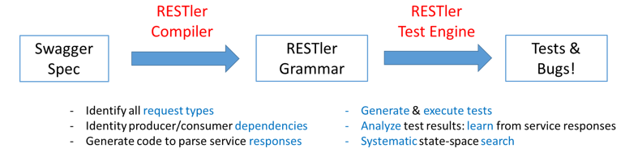

# RESTler

## What is RESTler?

RESTler is the *first stateful REST API fuzzing tool* for automatically
testing cloud services through their REST APIs and finding security and
reliability bugs in these services. For a given cloud service
with an OpenAPI/Swagger specification, RESTler analyzes its entire specification,
and then generates and executes tests that exercise the service through its REST API.

RESTler intelligently infers producer-consumer dependencies among request types from the Swagger
specification.  During testing, it checks for specific classes of bugs
and dynamically learns how the service behaves from prior service responses.
This intelligence allows RESTler to explore deeper service states
reachable only through specific request sequences and to find more bugs.

RESTler is described in these peer-reviewed research papers:

1. [RESTler: Stateful REST API Fuzzing](https://patricegodefroid.github.io/public_psfiles/icse2019.pdf) (ICSE'2019)
2. [Checking Security Properties of Cloud Service REST APIs](https://patricegodefroid.github.io/public_psfiles/icst2020.pdf) (ICST'2020)
3. [Differential Regression Testing for REST APIs​](https://patricegodefroid.github.io/public_psfiles/issta2020.pdf) (ISSTA'2020)
4. [Intelligent REST API Data Fuzzing​​](https://patricegodefroid.github.io/public_psfiles/fse2020.pdf) (FSE'2020)

If you use RESTler in your research, please cite the (default) ICSE'2019 paper ([BibTeX](./docs/user-guide/icse2019.bib)).

RESTler was created at Microsoft Research and is still under active development.



## Build Status

[](https://dev.azure.com/ms/restler-fuzzer/_build/latest?definitionId=422&branchName=main)


## Setting up RESTler

RESTler was designed to run on 64-bit machines with Windows or Linux.

### **Build instructions**

Prerequisites: Install [Python 3.8.2](https://www.python.org/downloads/) and
[.NET 5.0](https://dotnet.microsoft.com/download/dotnet-core?utm_source=getdotnetcorecli&utm_medium=referral), for your appropriate OS.

Create a directory where you'd like to place the RESTler binaries:

```mkdir restler_bin```

Switch to the repo root directory and run the following Python script:

```python ./build-restler.py --dest_dir <full path to restler_bin above>```

Note: if you get nuget error NU1403 when building, a quick workaround is to clear your cache with this command

```dotnet nuget locals all --clear```


### **Binary-drop instructions**

RESTler binary drops are coming soon.

Prerequisites: Install [Python 3.8.2](https://www.python.org/downloads/) and
[.NET 5.0](https://dotnet.microsoft.com/download/dotnet-core?utm_source=getdotnetcorecli&utm_medium=referral) or higher, for your appropriate OS.


## Using RESTler

RESTler runs in 4 main modes (in order):

1. **Compile:** from a Swagger JSON or YAML specification (and optionally examples), generate a RESTler grammar. See [Compiling](./docs/user-guide/Compiling.md).
2. **Test:** execute quickly all of the endpoints+methods in a compiled RESTler grammar for debugging the test setup and compute what parts of the Swagger spec are covered. This mode is also called a *smoketest*.
See [Testing](./docs/user-guide/Testing.md). To use custom test engine settings, see [Test Engine Settings](./docs/user-guide/SettingsFile.md).
3. **Fuzz-lean:** execute once every endpoint+method in a compiled RESTler grammar with a default set of checkers to see if bugs can be found quickly. See [Fuzzing](./docs/user-guide/Fuzzing.md).
4. **Fuzz:** bug hunting - explore a RESTler fuzzing grammar in smart breadth-first-search mode (deeper search mode) for finding more bugs.
**Warning:** This type of fuzzing is more aggressive and may create outages in the service under test if the service is poorly implemented (e.g., fuzzing might create resource leaks, perf degradation, backend corruptions, etc.).
See [Fuzzing](./docs/user-guide/Fuzzing.md).

## Quick Start

For a quick intro with simple examples, see this [Tutorial](./docs/user-guide/TutorialDemoServer.md).

To quickly try RESTler on your API, see [Quick Start](./docs/user-guide/QuickStart.md).

## Bugs found by RESTler
There are currently two categories of bugs found by RESTler.

- **Error code**: currently, any time a response with status code ```500``` ("Internal Server Error") is received, a bug is reported.
- **Checkers**: each checker tries to trigger specific bugs by executing targeted additional requests or sequences of requests at certain points during fuzzing, determined by context.  Some checkers try to find additional 500s, while other checkers try to find specific logic bugs such as resource leaks or hierarchy violations.  For a full description of checkers, see [Checkers](./docs/user-guide/Checkers.md).

When a bug is found, RESTler reports bugs triaged in bug buckets, and provides a replay log that can be used to reproduce the bug (see [Replay](./docs/user-guide/Replay.md)).


## Advanced Topics

For tips on using RESTler effectively, please see [Best Practices](./docs/user-guide/BestPractices.md) and [Improving Swagger Coverage](./docs/user-guide/ImprovingCoverage.md).

See also these [Frequently Asked Questions](./docs/user-guide/FAQ.md).

If you're interested in using RESTler at scale as part of your CI/CD pipeline, check out
the [REST API Fuzz Testing self-hosted service](https://github.com/microsoft/rest-api-fuzz-testing).

## Questions

If you have a request/suggestion/question, please file an issue.
See [Contributing.md](./docs/contributor-guide/Contributing.md) for instructions.

## Contributing

This project welcomes contributions and suggestions. Most contributions require you to
agree to a Contributor License Agreement (CLA) declaring that you have the right to,
and actually do, grant us the rights to use your contribution. For details, visit
https://cla.microsoft.com.

When you submit a pull request, a CLA-bot will automatically determine whether you need
to provide a CLA and decorate the PR appropriately (e.g., label, comment). Simply follow the
instructions provided by the bot. You will only need to do this once across all repositories using our CLA.

This project has adopted the [Microsoft Open Source Code of Conduct](https://opensource.microsoft.com/codeofconduct/).
For more information see the [Code of Conduct FAQ](https://opensource.microsoft.com/codeofconduct/faq/)
or contact [opencode@microsoft.com](mailto:opencode@microsoft.com) with any additional questions or comments.

For more information, see [Contributing.md](./docs/contributor-guide/Contributing.md).

## Trademarks

This project may contain trademarks or logos for projects, products, or services. Authorized use of Microsoft trademarks or logos is subject to and must follow Microsoft's Trademark & Brand Guidelines. Use of Microsoft trademarks or logos in modified versions of this project must not cause confusion or imply Microsoft sponsorship. Any use of third-party trademarks or logos are subject to those third-party's policies.

## Data collection

The software may collect information about you and your use of the software and send it to Microsoft. Microsoft may use this information to provide services and improve our products and services. You may turn off the telemetry as described in the repository. There are also some features in the software that may enable you and Microsoft to collect data from users of your applications. If you use these features, you must comply with applicable law, including providing appropriate notices to users of your applications together with a copy of Microsoft's privacy statement. Our privacy statement is located at https://go.microsoft.com/fwlink/?LinkID=824704. You can learn more about data collection and use in the help documentation and our privacy statement. Your use of the software operates as your consent to these practices.

For more information, see [Telemetry.md](./docs/user-guide/Telemetry.md).

## Reporting Security Issues

Security issues and bugs should be reported privately, via email, to the
Microsoft Security Response Center (MSRC) at
[secure@microsoft.com](mailto:secure@microsoft.com). You should receive a
response within 24 hours. If for some reason you do not, please follow up via
email to ensure we received your original message. Further information,
including the [MSRC PGP](https://technet.microsoft.com/en-us/security/dn606155)
key, can be found in the [Security TechCenter](https://technet.microsoft.com/en-us/security/default).

For additional details, see [Security.md](SECURITY.md).


# Privacy & Cookies

https://go.microsoft.com/fwlink/?LinkId=521839
