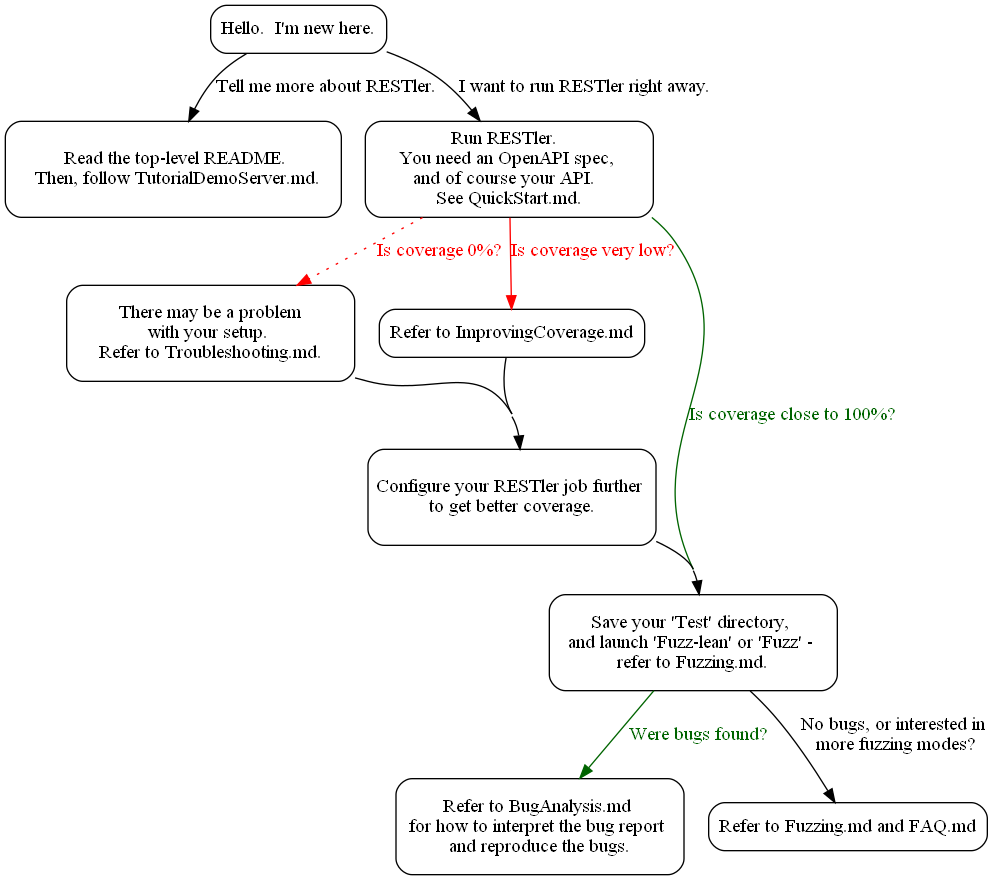

# Quick Start for Fuzzing with RESTler

RESTler generates tests from your API specification,
and executes these tests against your live service.
In this quick start, you will first run RESTler with
the minimal amount of input to try invoking the API.  Then, you will configure it
further in order to successfully test and fuzz your API.

## **Workflow**

Here is a high-level picture of first-time usage:



## **Minimal requirements**

The minimal requirements for fuzzing your API are:

1. A Swagger/OpenAPI specification
2. Scriptable authentication, if required by the API
(we will skip this requirement for now)

## **Initial run**

Once you have built RESTler per the steps in the main README, and
prepared (1) and (2), run the following command:

```python restler-quick-start.py --api_spec_path <path to specification> --restler_drop_dir <path to RESTler drop>```

This command combines the Compile and Test mode into one: it compiles the
Swagger specification and then tries to successfully
execute every request in the Swagger specification.
It will create any pre-requisite resources found in the API
in order to execute each request, so some requests may be executed more than once.

**Initial run results analysis**

Upon completion, the following json is printed
(and persisted to a file restler_quick_start_results.json).

``` json
{
    "found_requests": "29",
    "attempted_requests": "3",
    "successful_requests": "2",
    "coverage": "7%",
    "bugs_found": "0"
}
```

The above results are typical for an API that does not require
authentication and has a few GET endpoints without any input parameters.

- 29 requests (endpoint + method) were found in the Swagger spec.
- 3 requests were attempted by RESTler.
The other 26 were not attempted because RESTler determined that
they depend on outputs of one of the requests that were executed,
and a failure prevented that output resource from being available
to the other requests.
- 2 requests were successful.
- The coverage is 7% (2/29)
- There were no bugs found.  Sometimes, bugs are found in the quick start phase.

At this point, you may copy and extend the ```restler_quick_start.py``` script
for your needs as you continue to configure your test parameters to increase coverage.

**All requests failed**

If all requests failed, it is likely to be a configuration problem,
such as a incorrect IP, host, or port, or missing/failing authentication.
 Another variant is if a pre-provisioned resource that cannot be created through this API is a required path parameter for every endpoint (for example, all endpoints start with ```/api/{tenantId}```, and tenants are created by a separate admin API).

Typically, this type of error can be diagnosed from a single log entry for an executed request in the network logs. Search for the string "Sending:"
in the 'Test' directory, for example:

```
2020-09-17 17:27:44.292: Sending: 'GET /api/fuzzstring/docs\r\nContent-Length: 0 ...'
2020-09-17 17:27:44.503: Received: 'HTTP/1.1 404 Not Found\r\n ...'
```

We recommend picking one such request, executing it via CURL to get a sample set of successful parameters, and getting the request sent by RESTler to be identical.
If authentication is required, see [Authentication](Authentication.md) for
instructions on configuring authentication in RESTler.  If custom values are required (such as for pre-requisite resources or magic values), see [FuzzingDictionary](FuzzingDictionary.md).

**Very few requests succeeded**

We recommend an initial effort to increase coverage if it is low,
since the more valid requests RESTler can execute in this initial testing phase,
the better it will fuzz your API.
See [Improving Coverage](ImprovingCoverage.md) for an overview of how to increase coverage.
Because high coverage may be difficult to achieve for a given API
(for example, due to pre-provisioning of resources outside the API),
we recommend proceeding to fuzzing once coverage is around 50%.

## **Starting to fuzz**

For your first fuzzing run, the *fuzz-lean* mode is recommended.  This is a mode that fuzzes each successful request, but does not try all the combinations of parameters and request sequences.   For instructions on how to run this mode, see [Fuzzing](Fuzzing.md).

## **Bug buckets**

When RESTler finds bugs, a message is printed to the console with an overview of the types of bugs that were found.  For more details on interpreting the bug report, see [Bug Buckets](BugBuckets.md).  The bugs found by RESTler can also be reproduced using RESTler - see [Replay](Replay.md).

In addition, a summary of all the error status codes seen during the run is generated by parsing the network logs (see [Results Analyzer](ResultsAnalyzer.md)).  The user can review this error buckets report to find additional bugs that RESTler does not detect (for example, unexpected error codes or response formats for your specific application).
